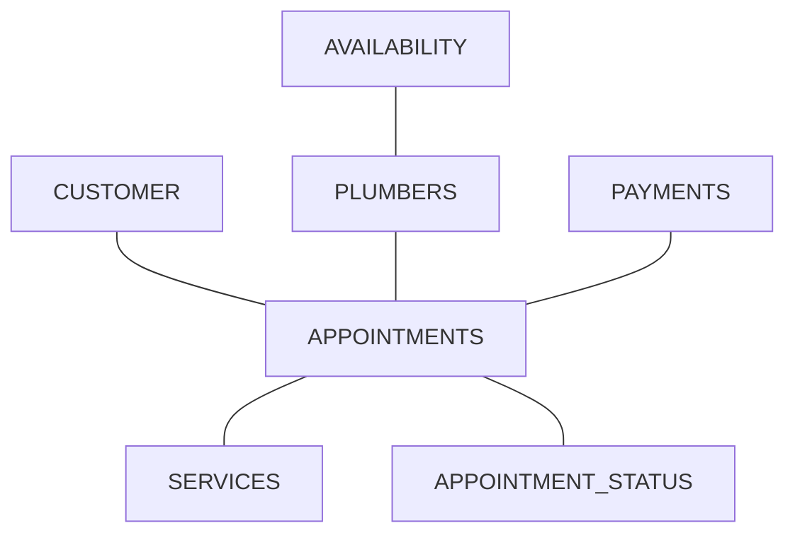
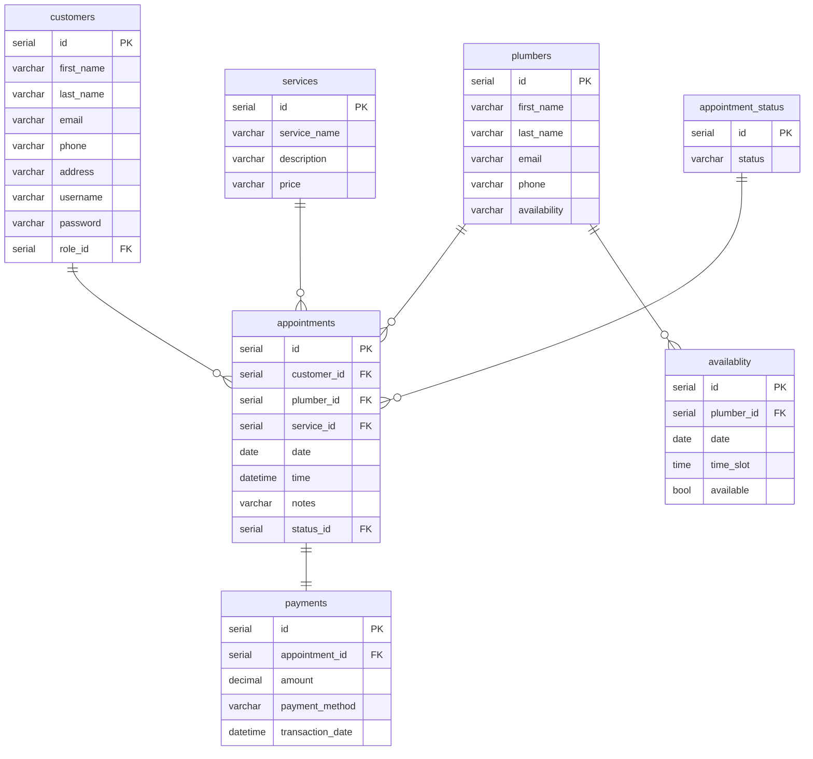

# Plumbing-Company-Appointment-System
A repository for Plumbing Company Appointment System Project.

### Domain Model

```mermaid
flowchart 
  CUSTOMER --- APPOINTMENTS
  PLUMBERS --- APPOINTMENTS
  APPOINTMENTS --- SERVICES
  APPOINTMENTS --- APPOINTMENT_STATUS
  PAYMENTS --- APPOINTMENTS
  AVAILABILITY --- PLUMBERS
```

### ER Diagram

```mermaid
erDiagram
  customers {
        serial id PK
        varchar first_name
        varchar last_name
        varchar email
        varchar phone
        varchar address
        varchar username
        varchar password
        serial role_id FK
    }

    appointments {
        serial id PK
        serial customer_id FK
        serial plumber_id FK
        serial service_id FK
        date date
        datetime time
        varchar notes
        serial status_id FK
    }

    plumbers {
        serial id PK
        varchar first_name 
        varchar last_name
        varchar email
        varchar phone
        varchar availability
    }

    services {
        serial id PK
        varchar service_name
        varchar description
        varchar price
    }

    appointment_status {
        serial id PK
        varchar status
    }

    payments {
        serial id PK
        serial appointment_id FK
        decimal amount
        varchar payment_method 
        datetime transaction_date
    }

    availablity {
        serial id PK
        serial plumber_id FK
        date date
        time time_slot
        bool available
    }

    customers ||--o{ appointments : ""
    plumbers ||--o{ appointments : ""
    services ||--o{ appointments : ""
    appointment_status ||--o{ appointments : ""
    appointments ||--|| payments : ""
    plumbers ||--o{ availablity : ""

```
