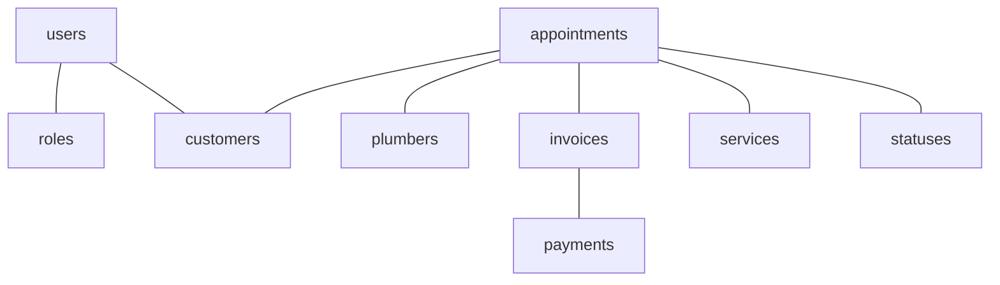
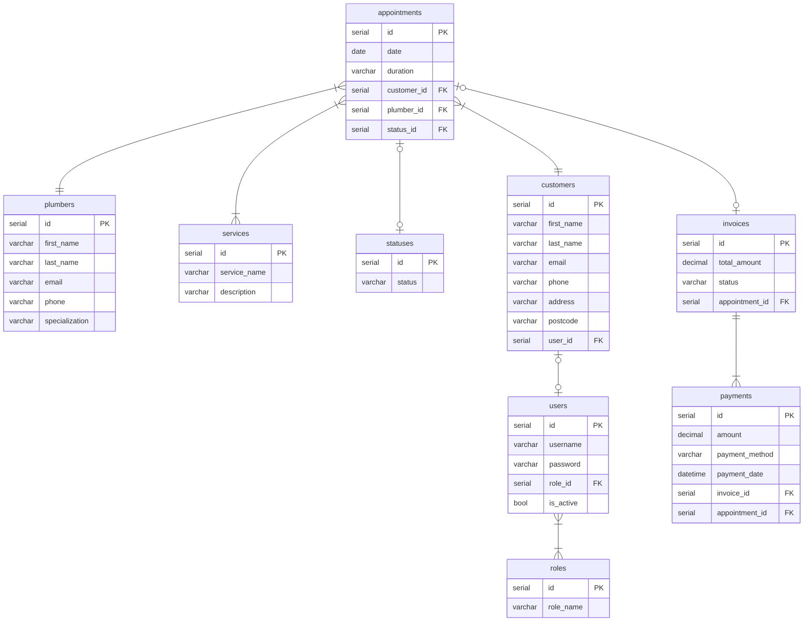

# Plumbing-Company-Appointment-System
A repository for Plumbing Company Appointment System Project.

### Domain Model


### ER Diagram


### API Specification
#### USERS
`GET /users` 
Return a list of all users

Response 200
```json
[
  {
    "id": 1,
    "first_name": "Kerry",
    "last_name": "Kennedy",
    "email": "kerrytkennedy@hotmail.com",
    "phone": "07584916321",
    "address": "78 Wellington Park Drive",
    "postcode": "BT893PT",
    "username": "KerryK0517",
    "role": {
      "id": 1,
      "role_name": "Admin"
    }
  },
  {
    "id": 2,
    "first_name": "Joe",
    "last_name": "Bloggs",
    "email": "jbloggs@email.com",
    "phone": "07819372198",
    "address": "123 New Street",
    "postcode": "JBloggs123",
    "username": "KerryK0517",
    "role": {
      "id": 2,
      "role_name": "User"
    }
  }
]
```
---
`GET /user/{user_id}`
Return a user

Response 200
```json
{
    "id": 1,
    "first_name": "Kerry",
    "last_name": "Kennedy",
    "email": "kerrytkennedy@hotmail.com",
    "phone": "07584916321",
    "address": "78 Wellington Park Drive",
    "postcode": "BT893PT",
    "username": "KerryK0517",
    "role": {
      "id": 1,
      "role_name": "Admin"
    }
}
```
---
`POST /user`
Create a user

Response - `201 Created`
```json
{
    "id": 1,
    "first_name": "Kerry",
    "last_name": "Kennedy",
    "email": "kerrytkennedy@hotmail.com",
    "phone": "07584916321",
    "address": "78 Wellington Park Drive",
    "postcode": "BT893PT",
    "username": "KerryK0517",
    "password": "password123",
    "role": {
      "id": 1,
      "role_name": "Admin"
    }
}
```
---
`PUT /users/{user_id}`
Update a user by id

Response - `200 OK`
Request
```json
{
  "is_active": false
}
```
---
`DELETE /users/{user_id}`
Delete a user by id

Response - `204 No Content`

---
#### PLUMBERS
`GET /plumbers` 
Return a list of all plumbers

Response 200
```json
[
  {
    "id": 1,
    "first_name": "Sophie",
    "last_name": "Bennet",
    "email": "sbennet@email.com",
    "phone": "02012345678",
    "availability" : "8 hours"
  },
  {
    "id": 2,
    "first_name": "Liam",
    "last_name": "Mitchell",
    "email": "liam.mitchell@example.com",
    "phone": "07712345678",
    "availability" : "9 hours"
  }
]
```
---
`GET /plumber/{plumber_id}`
Return a plumber

Response 200
```json
{
    "id": 1,
    "first_name": "Sophie",
    "last_name": "Bennet",
    "email": "sbennet@email.com",
    "phone": "02012345678",
    "availability" : "8 hours"
}
```
---
`POST /plumber`
Create a plumber

Response - `201 Created`
```json
{
    "first_name": "John",
    "last_name": "Doe",
    "email": "johndoe@example.com",
    "phone": "0123456789",
    "availability": "10 hours"
}
```
---
`PUT /plumber/{plumber_id}`
Update a plumber by id

Response - `200 OK`
Request
```json
{
    "availability": "12 hours"
}
```
---
`DELETE /plumbers/{plumber_id}`
Delete a plumber by id

Response - `204 No Content`

---
#### APPOINTMENTS
`GET /appointments` 
Return a list of all appointments

Response 200
```json
[
  {
    "id": 1,
    "plumber_id": 1,
    "service_id": 2,
    "date": "2024-03-15",
    "time": "10:00",
    "notes": "Repair leaking faucet",
    "status_id": 1
  },
  {
    "id": 2,
    "plumber_id": 2,
    "service_id": 1,
    "date": "2024-03-16",
    "time": "14:00",
    "notes": "Install new shower",
    "status_id": 1
  }
]
```
---
`GET /appointments/{appointment_id}`
Return an appointment

Response 200
```json
{
    "id": 1,
    "plumber_id": 1,
    "service_id": 2,
    "date": "2024-03-15",
    "time": "10:00",
    "notes": "Repair leaking faucet",
    "status_id": 1
}
```
---
`POST /appointment`
Create an appointment

Response - `201 Created`
```json
{
    "plumber_id": 1,
    "service_id": 2,
    "date": "2024-03-15",
    "time": "10:00",
    "notes": "Repair leaking faucet"
}
```
---
`PUT /appointment/{appointment_id}`
Update an appointment for a specific user

Response - `200 OK`
Request
```json
{
    "notes": "Repair leaking faucet in the kitchen"
}
```
---
`DELETE /appointment/{user_id}`
Delete an appointment for a specific user

Response - `204 No Content`

---
#### STATUSES
`GET /statuses` 
Return a list of all statuses

Response 200
```json
[
  {
    "id": 1,
    "status": "Pending"
  },
  {
    "id": 2,
    "status": "Waiting On Payment"
  }
]
```
---
`GET /statuses/{status_id}`
Return an appointment status

Response 200
```json
{
    "id": 1,
    "status": "Pending"
}
```
---
`POST /statuses`
Create a status

Response - `201 Created`
```json
{
    "status": "Work Complete"
}
```
---
`PUT /statuses/{statuses_id}`
Update an appointment status by appointment id

Response - `200 OK`
Request
```json
{
    "status": "Fully Paid"
}
```
---
`DELETE /appopintment_statuses/{status_id}`
Delete an appointment status by id

Response - `204 No Content`

---
#### CUSTOMERS
`GET /customers` 
Return a list of all customers

Response 200
```json
[
  {
    "id": 1,
    "first_name": "John",
    "last_name": "Doe",
    "email": "johndoe@example.com",
    "phone": "123456789",
    "address": "123 Main Street",
    "postcode": "12345"
  },
  {
    "id": 2,
    "first_name": "Jane",
    "last_name": "Smith",
    "email": "janesmith@example.com",
    "phone": "987654321",
    "address": "456 Elm Street",
    "postcode": "54321"
  }
]
```
---
`GET /customers/{customer_id}`
Return a customer by id

Response 200
```json
{
    "id": 1,
    "first_name": "John",
    "last_name": "Doe",
    "email": "johndoe@example.com",
    "phone": "123456789",
    "address": "123 Main Street",
    "postcode": "12345"
}
```
---
`POST /customer`
Create a customer

Response - `201 Created`
```json
{
    "first_name": "Alice",
    "last_name": "Johnson",
    "email": "alice@example.com",
    "phone": "555555555",
    "address": "789 Oak Street",
    "postcode": "67890"
}
```
---
`PUT /customers/{customer_id}`
Update customer by customer id

Response - `200 OK`
Request
```json
{
    "address": "123 Updated Avenue"
}
```
---
#### PAYMENTS
`GET /payments` 
Return a list of all payments

Response 200
```json
[
  {
    "id": 1,
    "appointment_id": 1,
    "amount": 200.00,
    "payment_method": "Card",
    "payment_date": "2024-03-24T00:00:00Z"
  },
  {
    "id": 2,
    "appointment_id": 2,
    "amount": 50.00,
    "payment_method": "Card",
    "payment_date": "2024-03-01T00:00:00Z"
  }
]
```
---
`GET /payment/{payment_id}`
Return a payment by id

Response 200
```json
{
    "id": 1,
    "appointment_id": 1,
    "amount": 200.00,
    "payment_method": "Card",
    "payment_date": "2024-03-24T00:00:00Z"
}
```
---
`POST /payment`
Create a payment record

Response - `201 Created`
```json
{
    "appointment_id": 3,
    "amount": 100.00,
    "payment_method": "Cash",
    "payment_date": "2024-03-25T00:00:00Z"
}
```
---
`PUT /payments/{payment_id}`
Update a payment by user id

Response - `200 OK`
Request
```json
{
    "amount": 150.00
}
```
---
#### SERVICES
`GET /services` 
Return a list of all services

Response 200
```json
[
  {
    "id": 1,
    "service_name": "Pipes",
    "description": "Pipe Fitting",
    "price": 30.00
  },
  {
    "id": 2,
    "service_name": "Shower",
    "description": "Shower Fitting",
    "price": 30.00
  }
]
```
---
`GET /services/{service_id}`
Return a service by id

Response 200
```json
  {
    "id": 1,
    "service_name": "Pipes",
    "description": "Pipe Fitting",
    "price": 30.00
}
```
---
`POST /services`
Create a new service

Response - `201 Created`
```json
{
    "service_name": "Boiler Service",
    "description": "Boiler Inspection and Maintenance",
    "price": 100.00
}
```
---
`PUT /services/{service_id}`
Update a service by id

Response - `200 OK`
Request
```json
{
    "price": 120.00
}
```
---
`DELETE /service/{service_id}`
Delete a service by id 

Response - `204 No Content`

---
#### ROLES
`GET /roles` 
Return a list of all roles

Response 200
```json
[
  {
    "id": 1,
    "role_name": "Admin"
  },
  {
    "id": 2,
    "role_name": "User"
  }
]
```
---
`GET /role/{role_id}`
Return a role

Response 200
```json
 {
    "id": 1,
    "role_name": "Admin"
}
```
---
`POST /role`
Create a role

Response - `201 Created`
```json
{
    "role_name": "Plumber"
}
```
---
`PUT /roles/{role_id}`
Update a role by id

Response - `201 Created`
```json
{
    "role_name": "SuperUser"
}
```
---
`DELETE /role/{role_id}`
Delete a role by role id 

Response - `204 No Content`

---
#### INVOICES
`GET /invoices` 
Return a list of all invoices

Response 200
```json
[
  {
    "id": 1,
    "total_amount": 200.00,
    "status": "Pending",
    "appointment_id": 1
  },
  {
    "id": 2,
    "total_amount": 150.00,
    "status": "Paid",
    "appointment_id": 2
  }
]
```
---
`GET /invoices/{invoice_id}`
Return an invoice by id

Response 200
```json
{
    "id": 1,
    "total_amount": 200.00,
    "status": "Pending",
    "appointment_id": 1
}
```
---
`POST /invoices`
Create an invoice

Response - `201 Created`
```json
{
    "total_amount": 100.00,
    "status": "Pending",
    "appointment_id": 3
}
```
---
`PUT /invoices/{invoice_id}`
Update an invoice by id

Response - `201 Created`
```json
{
    "status": "Paid"
}
```
---

