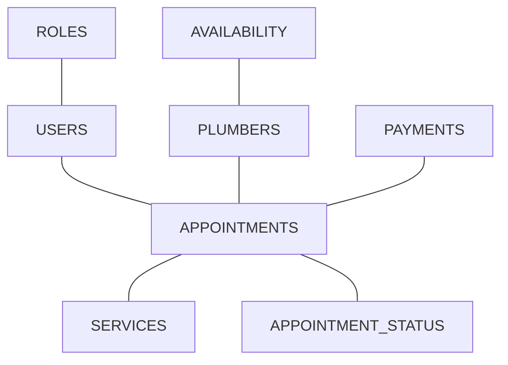
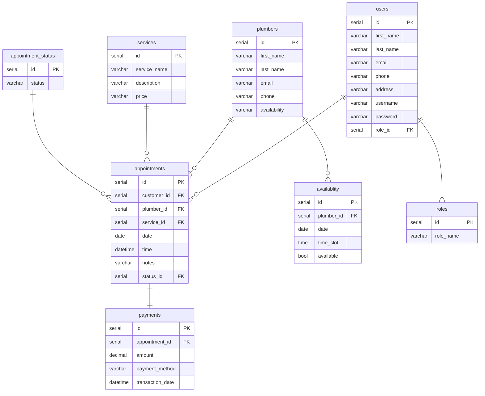

# Plumbing-Company-Appointment-System
A repository for Plumbing Company Appointment System Project.

### Domain Model


### ER Diagram


### API Specification
#### USERS
`GET /users` 
Return a list of all users

Response 200
```json
[
  {
    "id": 1,
    "first_name": "Kerry",
    "last_name": "Kennedy",
    "email": "kerrytkennedy@hotmail.com",
    "phone": "07584916321",
    "address": "78 Wellington Park Drive",
    "postcode": "BT893PT",
    "username": "KerryK0517",
    "password": "password123",
    "role_id" : 1
  },
  {
    "id": 2,
    "first_name": "Joe",
    "last_name": "Bloggs",
    "email": "jbloggs@email.com",
    "phone": "07819372198",
    "address": "123 New Street",
    "postcode": "JBloggs123",
    "password": "newpass1234",
    "role_id" : 2
  }
]
```
---
`GET /user/{user_id}`
Return a user

Response 200
```json
{
    "id": 1,
    "first_name": "Kerry",
    "last_name": "Kennedy",
    "email": "kerrytkennedy@hotmail.com",
    "phone": "07584916321",
    "address": "78 Wellington Park Drive",
    "postcode": "BT893PT",
    "username": "KerryK0517",
    "role_id" : 1
}
```
---
`POST /user`
Create a user

Response - `201 Created`
```json
{
    "id": 1,
    "first_name": "Kerry",
    "last_name": "Kennedy",
    "email": "kerrytkennedy@hotmail.com",
    "phone": "07584916321",
    "address": "78 Wellington Park Drive",
    "postcode": "BT893PT",
    "username": "KerryK0517",
    "password": "password123",
    "role_id" : 1
}
```
---
`PUT /users/{user_id}`
Update a user by id

Response - `200 OK`
Request
```json
{
"password": "password2"
}
```
---
`DELETE /users/{user_id}`
Delete a user by id

Response - `204 No Content`

---
#### PLUMBERS
`GET /plumbers` 
Return a list of all plumbers

Response 200
```json
[
  {
    "id": 1,
    "first_name": "Sophie",
    "last_name": "Bennet",
    "email": "sbennet@email.com",
    "phone": "02012345678",
    "availability" : "8 hours"
  },
  {
    "id": 2,
    "first_name": "Liam",
    "last_name": "Mitchell",
    "email": "liam.mitchell@example.com",
    "phone": "07712345678",
    "availability" : "9 hours"
  }
]
```
---
`GET /plumber/{plumber_id}`
Return a plumber

Response 200
```json
{
    "id": 1,
    "first_name": "Sophie",
    "last_name": "Bennet",
    "email": "sbennet@email.com",
    "phone": "02012345678",
    "availability" : "8 hours"
}
```
---
`POST /plumber`
Create a plumber

Response - `201 Created`
```json
{
    "id": 1,
    "first_name": "Sophie",
    "last_name": "Bennet",
    "email": "sbennet@email.com",
    "phone": "02012345678",
    "availability" : "8 hours"
}
```
---
`PUT /plumber/{plumber_id}`
Update a plumber by id

Response - `200 OK`
Request
```json
{
"availability": "10 hours"
}
```
---
`DELETE /plumbers/{plumber_id}`
Delete a plumber by id

Response - `204 No Content`

---
#### APPOINTMENTS
`GET /appointments` 
Return a list of all appointments

Response 200
```json
[
  {
    "id": 1,
    "plumber_id": 1,
    "service_id": 2,
    "date": "01/03/2024",
    "time": "08:00",
    "notes" : "Leaking tap in bathroom"
    "status_id" : 1
  },
  {
    "id": 2,
    "plumber_id": 1,
    "service_id": 1,
    "date": "04/03/2024",
    "time": "11:00",
    "notes" : "Install of new shower"
    "status_id" : 4
  }
]
```
---
`GET /appointments/{appointment_id}`
Return an appointment

Response 200
```json
{
    "id": 2,
    "plumber_id": 1,
    "service_id": 1,
    "date": "04/03/2024",
    "time": "11:00",
    "notes" : "Install of new shower"
    "status_id" : 4
}
```
---
`POST /appointment`
Create an appointment

Response - `201 Created`
```json
{
    "id": 2,
    "plumber_id": 1,
    "service_id": 1,
    "date": "04/03/2024",
    "time": "11:00",
    "notes" : "Install of new shower"
    "status_id" : 4
}
```
---
`PUT /appointment/{user_id}`
Update an appointment for a specific user

Response - `200 OK`
Request
```json
{
  "status_id": 3
}
```
---
`DELETE /appointment/{user_id}`
Delete an appointment for a specific user

Response - `204 No Content`

---
#### APPOINTMENT_STATUS
`GET /appointment_status` 
Return a list of all status'

Response 200
```json
[
  {
    "id": 1,
    "status": "Pending"
  },
  {
    "id": 2,
    "status": "Waiting On Payment"
  }
]
```
---
`GET /appointment_status/{status_id}`
Return an appointment status

Response 200
```json
[
  {
    "id": 1,
    "status": "Pending"
  },
  {
    "id": 2,
    "status": "Work Complete"
  }
]
```
---
`POST /appointment_status`
Create a status

Response - `201 Created`
```json
{
    "id": 3,
    "status": "Waiting On Payment"
}
```
---
`PUT /appointment_status/{appointment_id}`
Update an appointment status by appointment id

Response - `200 OK`
Request
```json
{
  "status": "Fully Paid"
}
```
---
`DELETE /appopintment_status/{status_id}`
Delete an appointment status by id

Response - `204 No Content`

---
#### AVAILABILITY
`GET /availability` 
Return a list of all availability

Response 200
```json
[
  {
    "id": 1,
    "plumber_id": 1,
    "service_id": 2,
    "date": "01/03/2024",
    "time": "08:00",
    "available": true
  },
  {
    "id": 2,
    "plumber_id": 1,
    "service_id": 1,
    "date": "04/03/2024",
    "time": "11:00",
    "available": false
  }
]
```
---
`GET /availability/{user_id}`
Return a users availability

Response 200
```json
{
    "id": 2,
    "plumber_id": 1,
    "service_id": 1,
    "date": "04/03/2024",
    "time": "11:00",
    "available": false
}
```
---
`POST /availability`
Create availability for a plumber

Response - `201 Created`
```json
{
    "id": 3,
    "plumber_id": 2,
    "service_id": 1,
    "date": "08/04/2024",
    "time": "11:00",
    "available": false
}
```
---
`PUT /availability/{plumber_id}`
Update availability by plumber id

Response - `200 OK`
Request
```json
{
    "available": true
}
```
---
#### PAYMENTS
`GET /payments` 
Return a list of all payments

Response 200
```json
[
  {
    "id": 1,
    "appointment_id": 1,
    "amount": 200.00,
    "payment_method": "Card",
    "transaction_date": "24/03/2024",
  },
  {
    "id": 2,
    "appointment_id": 2,
    "amount": 50.00,
    "payment_method": 'Card',
    "transaction_date": "01/03/2024",
  }
]
```
---
`GET /payment/{user_id}`
Return a users payments

Response 200
```json
  {
    "id": 1,
    "appointment_id": 1,
    "amount": 200.00,
    "payment_method": "Card",
    "transaction_date": "24/03/2024",
  },
```
---
`POST /payment`
Create a payment record

Response - `201 Created`
```json
  {
    "id": 1,
    "appointment_id": 1,
    "amount": 200.00,
    "payment_method": "Card",
    "transaction_date": "24/03/2024",
  },
```
---
`PUT /payment/{user_id}`
Update a payment by user id

Response - `200 OK`
Request
```json
{
    "amount": 60.00
}
```
---
#### SERVICES
`GET /services` 
Return a list of all services

Response 200
```json
[
  {
    "id": 1,
    "service_name": "Pipes",
    "description" : "Pipe Fitting",
    "price" : 30.00
  },
  {
    "id": 2,
    "service_name": "Shower",
    "description" : "Shower Fitting",
    "price" : 30.00
  }
]
```
---
`GET /services/{plumber_id}`
Return a plumbers services

Response 200
```json
   [
  {
    "id": 1,
    "service_name": "Pipes",
    "description" : "Pipe Fitting",
    "price" : 30.00
  },
  {
    "id": 1,
    "service_name": "Shower",
    "description" : "Shower Fitting",
    "price" : 30.00
  }
]
```
---
`POST /services`
Create a new service

Response - `201 Created`
```json
{
    "id": 1,
    "service_name": "Service",
    "description" : "Boiler Service",
    "price" : 250.00
}
```
---
`PUT /services/{plumber_id}`
Update a service by plumber id

Response - `200 OK`
Request
```json
{
    "price": 50.00
}
```
---
`DELETE /service/{plumber_id}`
Delete a service by plumber id 

Response - `204 No Content`

---
