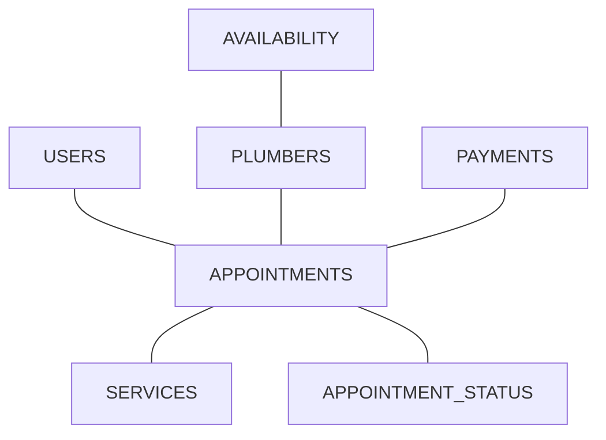
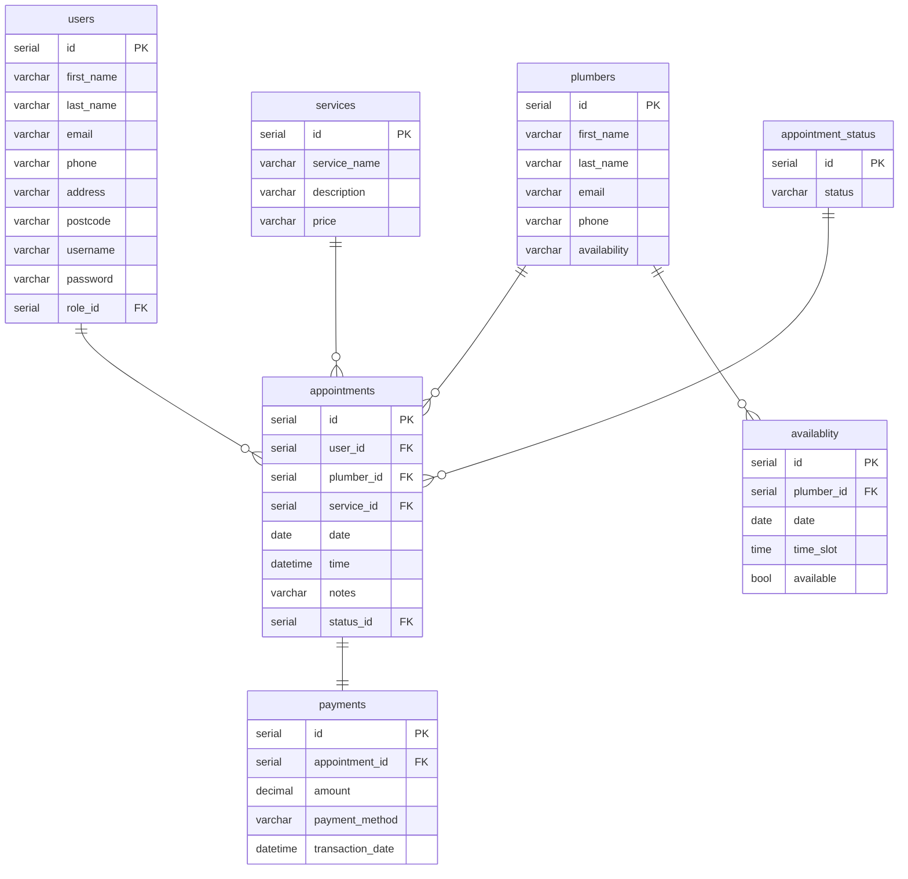

# Plumbing-Company-Appointment-System
A repository for Plumbing Company Appointment System Project.

### Domain Model


### ER Diagram


### API Specification
#### USERS
`GET /users` 
Return a list of all users

Response 200
```json
[
  {
    "id": 1,
    "first_name": "Kerry",
    "last_name": "Kennedy",
    "email": "kerrytkennedy@hotmail.com",
    "phone": "07584916321",
    "address": "78 Wellington Park Drive",
    "postcode": "BT893PT",
    "username": "KerryK0517",
    "password": "password123",
    "role_id" : 1
  },
  {
    "id": 2,
    "first_name": "Joe",
    "last_name": "Bloggs",
    "email": "jbloggs@email.com",
    "phone": "07819372198",
    "address": "123 New Street",
    "postcode": "JBloggs123",
    "password": "newpass1234",
    "role_id" : 2
  }
]
```
---
